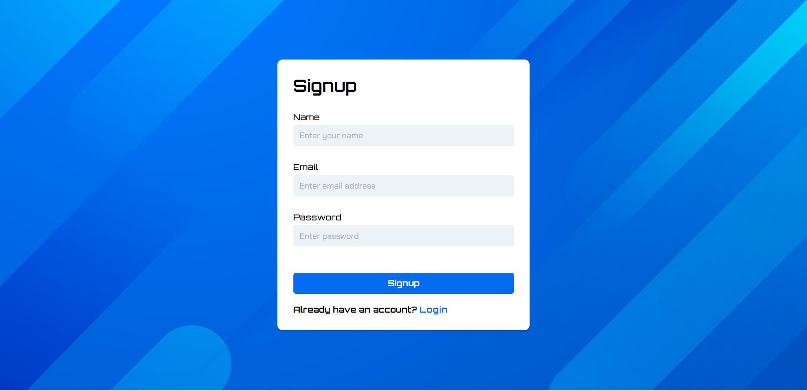
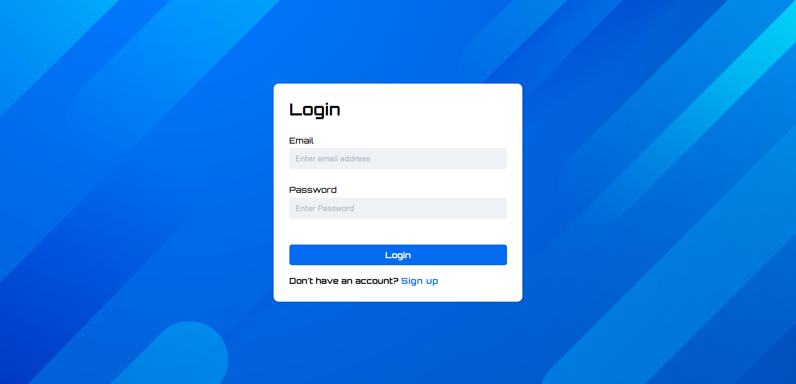

# 🤖 Dev Secure - AI-Powered Code Security Analyzer

`Dev Secure` is an AI-powered tool that detects vulnerabilities in code and rates them as high, low, or average. Leveraging the Ollama Mistral model running locally, it provides a chat-like interface for analyzing code security issues in real-time.

## 📸 Preview

### SignUp Page


### LogIn Page


### Home Page


### ChatBot UI


## ✨ Features

- **Real-time vulnerability analysis**: Users can input code and receive instant feedback on its security.
- **AI-powered vulnerability detection**: The chatbot leverages the Ollama Mistral LLM for detecting and assessing code vulnerabilities.
- **Conversational AI**: Engage in natural, interactive conversations about code security.
- **Responsive and clean UI**: The user interface adapts to various screen sizes, providing a visually appealing and intuitive experience.
- **Authentication**: Users can sign up and log in via Firebase for personalized sessions.
- **Firebase integration**: Firebase handles secure user authentication and real-time data management.

## 🤖 Technologies Used

`Dev Secure` is built using the following technologies:

- **React.js**: A JavaScript library for building user interfaces.
- **CSS Modules**: Locally scoped CSS for styling React components.
- **Ollama Mistral LLM**: A locally running language model that detects code vulnerabilities.
- **Node.js**: JavaScript runtime environment for server-side operations.
- **Express**: A web application framework for Node.js, managing API routes and requests.
- **React Router**: For handling routing within the React application.
- **Axios**: A promise-based HTTP client for making API requests from the frontend.
- **Firebase**: For authentication, hosting, and real-time data storage.
- **dotenv**: For loading environment variables from a `.env` file.
- **CORS**: To handle cross-origin requests in web browsers.
- **Nodemon**: Automatically restarts the server when code changes.

## ✨ Prerequisites

Before getting started, ensure you have the following prerequisites installed:

- **Node.js**: Download and install Node.js from the official [website](https://nodejs.org).
- **Firebase account**: Create a Firebase account and set up a new project.
- **Ollama Mistral LLM**: Ensure the model is running locally for real-time analysis.

## 💻 Getting Started

To run `Dev Secure` locally, follow these steps:

1. Clone the repository: `https://github.com/its-kumar-yash/react-ai-chatbot-app.git`
2. Navigate to the project directory: `cd react-ai-chatbot-app`
3. Install the dependencies: `npm install`
4. Start the frontend server:
   ```bash
   cd frontend
   npm start
5. Start the backend server:
```bash
   cd backend
   npm start
